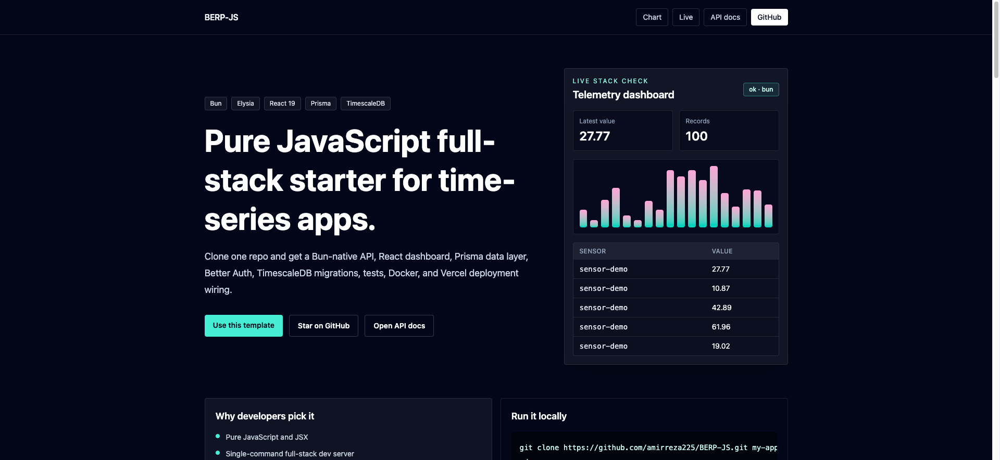

# BERP-JS

Pure JavaScript full-stack starter for **Bun, Elysia, React, Prisma, and TimescaleDB**.

[Live preview](https://berp-js.vercel.app/) · [API docs](https://berp-js.vercel.app/swagger) · [Use this template](https://github.com/amirreza225/BERP-JS/generate)



BERP-JS gives you a working app, not a pile of configuration. It includes a Bun-native API, React dashboard, Prisma data layer, Better Auth, TimescaleDB migrations, Docker, Vercel deployment output, Vitest, Playwright, and Biome.

No TypeScript. No Vite. No Next.js. No SSR framework.

## Why This Exists

Most full-stack starters optimize for TypeScript-heavy meta-frameworks. BERP-JS is for developers who want a small, inspectable JavaScript codebase with a real database-backed example and a production deployment path.

It is especially useful for:

- telemetry dashboards
- IoT and sensor projects
- internal tools
- analytics panels
- Bun and Elysia experiments
- hackathon projects that need a real backend quickly

## Stack

| Layer | Technology |
| --- | --- |
| Runtime | Bun |
| API | Elysia |
| Frontend | React 19, React Router, TanStack Query |
| Database | PostgreSQL and TimescaleDB |
| ORM | Prisma |
| Auth | Better Auth |
| Styling | Tailwind CSS v4 |
| Tests | Vitest, Playwright |
| Quality | Biome, Lefthook |
| Deploy | Vercel Build Output API, Docker |

## Quick Start

```bash
git clone https://github.com/amirreza225/BERP-JS.git my-app
cd my-app
cp .env.example .env
docker compose up -d
bun install
bun run db:migrate
bun run db:seed
bun run dev
```

Open:

- App: <http://localhost:3000>
- Swagger API docs: <http://localhost:3000/swagger>

## What You Get

- Bun workspaces monorepo with `apps/api`, `apps/web`, and `packages/db`
- Elysia API with health, auth, and sensor data routes
- Swagger docs mounted at `/swagger`
- React dashboard that reads and writes live sensor data
- Prisma schema and migrations for PostgreSQL and TimescaleDB
- TimescaleDB hypertable migration for `SensorData`
- Better Auth session tables and server integration
- Docker Compose database for local development
- Vercel production build output
- Biome formatting/linting
- Vitest unit tests and Playwright E2E wiring

## Project Structure

```text
BERP-JS/
├── apps/
│   ├── api/
│   │   ├── api/[...path].js
│   │   └── src/
│   │       ├── index.js
│   │       ├── server.js
│   │       ├── lib/
│   │       └── routes/
│   └── web/
│       ├── public/
│       └── src/
├── packages/
│   └── db/
│       ├── prisma/
│       └── src/
├── build.js
├── docker-compose.yml
├── Dockerfile
└── vercel.json
```

## Scripts

```bash
bun run dev             # Start web watcher and API server
bun run build           # Build Vercel output
bun run lint            # Run Biome checks
bun run format          # Format with Biome
bun run test            # Run Vitest
bun run test:e2e        # Run Playwright
bun run prisma:validate # Validate the Prisma schema
bun run db:migrate      # Run Prisma migrate dev
bun run db:seed         # Seed sample sensor data
bun run db:studio       # Open Prisma Studio
```

## Environment

Start from `.env.example`:

```bash
cp .env.example .env
```

Required variables:

| Variable | Purpose |
| --- | --- |
| `DATABASE_URL` | Runtime database connection |
| `DIRECT_DATABASE_URL` | Direct Prisma migration connection |
| `BETTER_AUTH_URL` | Public app URL for Better Auth |
| `BETTER_AUTH_SECRET` | Secret used by Better Auth |

For production, generate a strong `BETTER_AUTH_SECRET` and set `CORS_ORIGIN` to your production domain.

## Deploy To Vercel

Set these environment variables in Vercel:

- `DATABASE_URL`
- `DIRECT_DATABASE_URL`
- `BETTER_AUTH_URL`
- `BETTER_AUTH_SECRET`
- `CORS_ORIGIN`

Then deploy:

```bash
vercel --prod
```

The custom `build.js` generates Vercel Build Output API files so the React app and Elysia serverless function deploy together.

## Docker

```bash
docker compose up -d
docker build -t berp-js .
docker run -p 3000:3000 --env-file .env berp-js
```

## Deploy to Railway

1. Install the Railway CLI and log in:
   ```bash
   npm install -g @railway/cli
   railway login
   ```
2. Initialise a project and add PostgreSQL:
   ```bash
   railway init
   railway add --plugin postgresql
   ```
3. Set secrets (Railway auto-provides `DATABASE_URL`):
   ```bash
   railway variables set \
     DIRECT_DATABASE_URL="$DATABASE_URL" \
     BETTER_AUTH_SECRET="$(openssl rand -hex 32)" \
     CORS_ORIGIN="https://<your-app>.up.railway.app"
   ```
4. Deploy:
   ```bash
   railway up
   ```

The `Dockerfile` in this repo works with Railway out of the box.

## Deploy to Fly.io

1. Install Fly CLI and log in:
   ```bash
   brew install flyctl
   fly auth login
   ```
2. Launch the app (skip auto-deploy):
   ```bash
   fly launch --no-deploy
   ```
3. Provision and attach a PostgreSQL cluster:
   ```bash
   fly postgres create --name berp-js-db
   fly postgres attach berp-js-db
   ```
   Fly sets `DATABASE_URL` automatically after attach.
4. Set remaining secrets:
   ```bash
   fly secrets set \
     DIRECT_DATABASE_URL="<postgres-connection-string>" \
     BETTER_AUTH_SECRET="$(openssl rand -hex 32)" \
     CORS_ORIGIN="https://<your-app>.fly.dev"
   ```
5. Deploy:
   ```bash
   fly deploy
   ```

## Adding shadcn/ui Components

BERP-JS uses plain Tailwind CSS v4. shadcn/ui components are copy-paste source, so no CLI or TypeScript is required.

1. Add the `cn` utility dependencies:
   ```bash
   bun add --cwd apps/web clsx tailwind-merge
   ```
2. Create `apps/web/src/lib/utils.js`:
   ```js
   import { clsx } from "clsx";
   import { twMerge } from "tailwind-merge";
   export function cn(...inputs) {
     return twMerge(clsx(inputs));
   }
   ```
3. Browse [ui.shadcn.com](https://ui.shadcn.com/docs/components), copy the source of any component into `apps/web/src/components/ui/`.
4. Remove TypeScript annotations (`interface`, `: Type`, `as Type`) and rename any `class:` props to `className`.

Tailwind v4 picks up new utility classes automatically — no config changes needed.

## Charting

`/chart` renders a pure-SVG line chart of the most recent 100 sensor readings, one line per sensor ID. No charting library is required. The component is in `apps/web/src/index.jsx` (`SensorLineChart`).

## Background Jobs

`apps/api/src/jobs/aggregator.js` exports `startAggregator()`, which runs a `setInterval` every 60 seconds, counts total sensor records, and logs the result. It is started in `apps/api/src/index.js` and shut down cleanly on `SIGTERM`.

Extend it with any periodic work: data rollups, alert checks, cache warming, etc.

## WebSocket Telemetry Stream

The API exposes a WebSocket endpoint at `/api/ws/sensor`. Every successful `POST /api/sensor` broadcasts the new record to all connected clients.

The `/live` page in the React app subscribes and displays events in real time.

> **Note:** WebSocket requires a persistent server process. It works in self-hosted deployments (Docker, Railway, Fly.io) but is not available on Vercel serverless.


## Contributing

Contributions are welcome. Good first issues include docs improvements, deployment guides, tests, examples, and UI polish.

Read [CONTRIBUTING.md](./CONTRIBUTING.md) before opening a pull request.

## License

MIT
